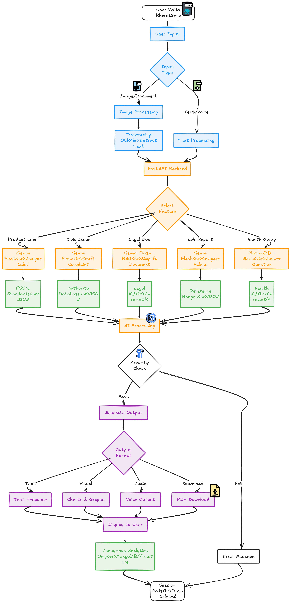

# BharatSetu
## Technical Documentation
### Connecting Communities to Information, Resources & Public Services

**AI-Powered Citizen Empowerment Platform**

---

## Executive Summary

BharatSetu is an AI-driven suite of tools designed to empower Indian citizens with accessible information and public services. The platform addresses critical gaps in health literacy, civic awareness, legal rights, and women's health education through five core features, all powered by advanced natural language processing and computer vision technologies.

The platform leverages Google Gemini 1.5 Flash as the primary language model, with Groq (Llama 3.1) as a fallback, ensuring high-quality, multilingual responses while maintaining zero-cost operation within free tier limits. All features are built with a React frontend and FastAPI backend, deployable on free hosting services.

---

## Table of Contents

1. System Architecture
2. Feature 1: Product Label Auditor (Label Padhega India)
3. Feature 2: CivicSense (Awareness & Reporting)
4. Feature 3: Document Jargon & Legal/Financial Rights Assistant
5. Feature 4: Lab Report Analyzer
6. Feature 5: GynaeCare Women's Health Module
7. Data Privacy and Security
8. Deployment Architecture
9. References

---

## 1. System Architecture

### 1.1 Technology Stack

#### Frontend
- **Framework:** React.js
- **Visualization:** Recharts/Chart.js for data presentation
- **OCR:** Tesseract.js (client-side processing)
- **Speech Recognition:** Web Speech API
- **Deployment:** Vercel (free tier)

#### Backend
- **Framework:** FastAPI (Python)
- **Primary LLM:** Google Gemini 1.5 Flash (15 RPM, 1M TPM free tier)
- **Fallback LLM:** Groq (Llama 3.1 70B) for overflow traffic
- **OCR Fallback:** Google Cloud Vision API (1000 requests/month free)
- **Translation:** Google Translate API (free quota)
- **Deployment:** Render.com (750 hours/month free tier)

#### Data Storage
- **Static Knowledge Base:** JSON files (in-memory loading)
- **Vector Database:** ChromaDB (local, in-memory) for RAG operations
- **Optional Session Storage:** Firebase Firestore (1 GB free, 50K reads/day)
- **File Storage:** Cloudinary (25 GB free tier)
- **Embedding Model:** all-MiniLM-L6-v2 (local, open-source)

### 1.2 Design Principles

- **Privacy-First:** Minimal to zero data retention for sensitive features
- **Multilingual:** Support for Hindi, English, and regional languages
- **Accessibility:** Voice input/output for low-literacy users
- **Cost-Effective:** Entire system operates within free tier limits
- **Responsible AI:** Clear disclaimers and limitations, especially for health features
### 1.3 User flow diagram



---

## 2. Feature 1: Product Label Auditor (Label Padhega India)

### 2.1 Problem Statement

Studies indicate that approximately 90% of Indian consumers read product labels, but only 33% check nutrition facts or ingredients [1]. This poor label literacy contributes to unhealthy diets, which now account for 56% of India's disease burden [2]. Non-communicable diseases (NCDs) cause 6 million deaths annually (63% of all deaths in India) [3].

### 2.2 Solution Overview

The Product Label Auditor uses AI to translate complex product labels into simple, personalized health guidance. Users photograph food or cosmetic labels, and the system extracts text via OCR, cross-checks nutritional values against FSSAI and WHO standards, and generates plain-language summaries with health alerts.

### 2.3 Technical Architecture

#### Processing Pipeline

**Option 1 (OCR-first approach):**

1. Image uploaded by user
2. Tesseract.js extracts text (client-side)
3. Gemini Flash structures data into JSON schema
4. System compares values against FSSAI knowledge base
5. Gemini generates personalized analysis based on user health context
6. Frontend displays results with visualizations

**Option 2 (Direct image analysis - Recommended):**

1. Image sent directly to Gemini 1.5 Flash (multimodal capability)
2. Model extracts and structures data in single API call
3. Analysis and visualization generation

Note: Direct image input uses 2-4x more tokens but provides better accuracy for curved labels, poor image quality, and visual context understanding.

#### Data Schema

Structured extraction format:

```json
{
  "product_name": "",
  "ingredients": [],
  "nutrition_per_100g": {},
  "additives": [],
  "claims": []
}
```

#### Knowledge Base Structure

FSSAI and WHO nutritional standards stored as JSON:

```json
{
  "sugar_daily_limit": "50g",
  "sodium_limit": "2300mg",
  "trans_fat_limit": "0g",
  "saturated_fat_limit": "20g"
}
```

#### User Interaction Flow

1. User inputs health condition via text or voice (e.g., diabetes, hypertension)
2. User uploads product label image
3. System processes and generates personalized analysis
4. Results displayed as:
   - Text/audio output in user's preferred language
   - Bar charts showing nutritional content per 100g
   - Highlighted flags for health concerns or false claims
   - Educational videos about misleading products (optional section)

### 2.4 Data Storage

**MongoDB Atlas (512 MB free tier) for storing:**
- Anonymous analysis history (no personally identifiable information)
- Aggregate statistics for product categories
- User preference settings (language, health conditions)

**Cloudinary (25 GB free) for temporary image storage** with automatic deletion after analysis.

---

## 3. Feature 2: CivicSense (Awareness & Reporting)

### 3.1 Problem Statement

Despite infrastructure initiatives like Swachh Bharat Mission, approximately 157 million Indians (11% of the population) still practiced open defecation as of 2022 [4]. Civic issues such as littering, waste dumping, and public space neglect persist due to lack of awareness and accessible reporting mechanisms.

### 3.2 Solution Overview

CivicSense empowers citizens to report civic issues through an intelligent complaint routing system. The platform identifies the issue type, determines the appropriate authority, drafts professional complaints, and provides multiple submission channels without requiring complex navigation of government portals.

### 3.3 Technical Architecture

#### Processing Pipeline

1. **User Input:** Text/voice complaint with optional image/video proof
2. **Language Detection:** Automatic detection of Hindi, English, or regional language
3. **Issue Extraction:** Gemini Flash identifies issue type and urgency level
4. **Authority Resolution:** Maps location + issue type to appropriate department
5. **Complaint Formatting:** Generates professional complaint message with all details
6. **Multi-Channel Presentation:** Shows user available submission options

#### Authority Database Structure

Comprehensive JSON database mapping issues to authorities:

```json
{
  "maharashtra": {
    "pune": {
      "garbage_disposal": {
        "authority": "PMC Solid Waste Management",
        "channels": {
          "whatsapp": "+91-20-XXXX-XXXX",
          "web_portal": "https://portal.punecorporation.org",
          "email": "swm.pmc@punecorporation.org",
          "phone": "020-26123456"
        },
        "expected_response_time": "48 hours",
        "escalation": {
          "if_no_response": "Commissioner Office",
          "contact": "commissioner@pmc.gov.in"
        }
      }
    }
  }
}
```

#### Submission Tiers

**Tier 1 - Direct Channels (User sends directly):**
- WhatsApp: Pre-filled message with proof attached
- Email: Formatted email with subject and attachments
- SMS: Short summary for toll-free numbers

**Tier 2 - Semi-Automated:**
- Pre-filled web portal links with query parameters
- User clicks to open form with data pre-populated

**Tier 3 - Manual Information:**
- Contact information displayed (phone, office address)
- Mobile app download links
- Office visit hours and location

### 3.4 Data Sources for Authority Database

- Government websites: punecorporation.org, maharashtra.gov.in/grievances
- Swachhata App: National cleanliness grievance platform
- CPGRAMS: Central Public Grievance Redress System
- State CM Helpline numbers
- Manual verification through municipal corporation contacts

### 3.5 Data Storage

**Firebase Firestore (1 GB free) for:**
- Anonymous complaint history (no personal identification)
- Complaint status tracking
- Aggregate statistics for heat map visualization

---

## 4. Feature 3: Document Jargon & Legal/Financial Rights Assistant

### 4.1 Problem Statement

A majority of Indians are not aware of their fundamental and legal rights, leading to repeated rights violations [5]. Complex legal language, fee barriers, and bureaucratic jargon prevent citizens from claiming entitlements. Low-income groups often sign unjust contracts due to ignorance of legal protections.

### 4.2 Solution Overview

This assistant interprets laws and rights in conversational terms, simplifies government documents, and provides step-by-step guidance for claiming entitlements. Users can upload documents for automatic simplification or ask questions about their rights.

### 4.3 Technical Architecture

#### Components

- **OCR:** Tesseract.js for document text extraction
- **Simplification:** Gemini Flash for plain-language rewriting
- **Legal Knowledge Base:** Curated FAQ database (50-100 common scenarios)
- **RAG System:** ChromaDB with legal document embeddings
- **Translation:** Google Translate API for regional language support

#### Knowledge Base Structure

**Static legal FAQ database (Type 1 - JSON file):**

```json
{
  "tenant_rights": {
    "question": "Can landlord increase rent without notice?",
    "answer": "No. Under Model Tenancy Act 2021...",
    "source": "Model Tenancy Act 2021, Section 7",
    "category": "housing",
    "hindi_answer": "नहीं। मॉडल टेनेंसी एक्ट..."
  }
}
```

**Vector embeddings database (Type 2 - ChromaDB):**
- Legal document chunks from IndiaCode.nic.in
- Embeddings generated using all-MiniLM-L6-v2
- Metadata includes source, act name, section numbers

#### Query Processing Flow

1. User question received (text or voice)
2. Fuzzy matching against FAQ database using FuzzyWuzzy
3. If no match: RAG search through legal documents
4. Gemini Flash generates plain-language answer
5. Source citation added (act name, section)
6. Translation to user's preferred language

### 4.4 Data Sources

- IndiaCode.nic.in: Government legal database
- DistrictCourtsOfIndia.nic.in: Court judgments and procedures
- LegalServicesIndia.com: Curated articles
- Manual curation of 50-100 common legal scenarios

### 4.5 Data Storage

- **Legal KB:** JSON file (5-10 MB) loaded in-memory
- **Vector Database:** ChromaDB local persistence (50-100 MB)
- **User uploads:** Cloudinary temporary storage, auto-deleted post-processing
- **Session data:** Firebase Firestore (optional, anonymous)

---

## 5. Feature 4: Lab Report Analyzer

### 5.1 Problem Statement

Research shows only 39% of patients can correctly identify from a standard pathology report whether they have cancer [6]. Patients routinely receive complex lab reports without adequate explanation, leading to anxiety and poor follow-through on health recommendations.

### 5.2 Solution Scope

**Important Limitation:**

This is an educational tool for value comparison only. It does NOT diagnose conditions, provide medical advice, or replace doctor consultation. The system compares lab values against standard reference ranges and suggests general wellness approaches.

### 5.3 Technical Architecture

#### Processing Pipeline

1. **User Input:** Lab report (PDF/DOC/image) + age + gender + optional conditions
2. **OCR Extraction:** Tesseract.js (client-side) with Google Cloud Vision fallback
3. **Value Parsing:** Gemini Flash structures data into JSON
4. **Reference Comparison:** Match values against WHO/ICMR standards by age/gender
5. **Diet Suggestions:** Gemini generates general wellness recommendations
6. **Visualization:** React displays bar charts with color-coded ranges

#### Reference Ranges Database

JSON structure with age/gender-specific ranges:

```json
{
  "hemoglobin": {
    "male": {
      "age_18_50": {"min": 13.5, "max": 17.5, "unit": "g/dL"}
    },
    "female": {
      "age_18_50": {"min": 12.0, "max": 15.5, "unit": "g/dL"}
    }
  },
  "glucose_fasting": {
    "all": {
      "normal": {"min": 70, "max": 100, "unit": "mg/dL"},
      "prediabetes_warning": {"min": 100, "max": 125},
      "consult_doctor": {"min": 126}
    }
  }
}
```

#### User Interface Features

- Mandatory disclaimer popup before feature access
- OCR verification step (user confirms extracted values)
- Visual comparison charts (your value vs. healthy range)
- Color coding: Green (normal), Yellow (borderline), Red (outside range)
- India-specific diet suggestions (palak, dal, amla, etc.)
- Prominent disclaimers throughout interface
- Downloadable summary PDF (saved locally, not on server)

### 5.4 Privacy and Safety

**Data Storage: ZERO**
- All processing in-memory
- No retention of lab reports, values, or personal information
- Session data deleted when tab closes
- Anonymous usage statistics only (test categories, not values)

**Safety Measures:**
- Rate limiting: 5 reports per hour per device
- File validation: PDF/JPG/PNG only, max 10 MB
- Emergency detection: Flags critical values with urgent warning
- Mandatory Terms of Service acceptance before use

---

## 6. Feature 5: GynaeCare Women's Health Module

### 6.1 Problem Statement

A systematic review found only 48% of adolescent girls in India knew about menstruation before their first period [7]. Cultural taboos and lack of education persist. Regarding PCOS, which affects 6-13% of women globally (up to 20% in India), approximately 45% of affected women knew nothing about the condition even after multiple doctor visits [8].

### 6.2 Solution Overview

GynaeCare provides stigma-free, verified information about menstrual health, PCOS, pregnancy basics, and general wellness through an anonymous chatbot interface. The system uses retrieval-augmented generation (RAG) to provide accurate answers sourced from WHO, UNICEF, and NHS materials.

### 6.3 Technical Architecture

#### Core Modules

1. **Menstrual Health Education:** Cycle explanation, hygiene products, myth-busting
2. **PCOS Awareness:** Symptoms checklist, lifestyle management, when to seek help
3. **Pregnancy Basics:** Trimester changes, nutrition, warning signs
4. **General Wellness:** Breast health, mental health, contraception basics

#### RAG Implementation

**Knowledge Base Creation:**
- Curated content from WHO, UNICEF, NHS, National Health Mission India
- JSON format with English and Hindi translations
- Size: 20-50 MB comprehensive knowledge base
- Embedded using all-MiniLM-L6-v2 (local model)
- Stored in ChromaDB (in-memory)

**Conversation Flow:**

1. User asks question (text or voice, Hindi/English)
2. Query embedded and searched in vector database
3. Top 3 relevant knowledge chunks retrieved
4. Gemini Flash generates empathetic response using context
5. Response includes disclaimer to consult doctor for medical concerns
6. Emergency keywords trigger immediate warning messages

#### Interactive Features

- **Myth Buster Quiz:** Swipeable cards with instant explanations
- **PCOS Symptom Checker:** Checkbox interface with personalized suggestions
- **Period Tracker:** Calendar with cycle predictions (100% local storage)
- **Resource Library:** Curated articles, videos, infographics

### 6.4 Privacy and Safety

**Data Storage: ZERO permanent storage**
- No user identification (anonymous chat)
- Questions not logged or saved
- Period tracker data stored in browser localStorage only
- Optional 24-hour anonymous session cache (conversation count only)

**Content Safety:**
- Age-appropriate responses (10-14, 15-25, 25-40 age groups)
- Blocked keywords: abortion pills, sex determination (illegal in India)
- Emergency detection for severe symptoms
- Helpline numbers provided: Medical (108), Women's Helpline (181), Mental Health (1860-2662-345)

---

## 7. Data Privacy and Security

### 7.1 Privacy-First Design

BharatSetu implements strict data minimization principles, particularly for health-related features. In compliance with India's Digital Personal Data Protection Act (DPDP) 2023, the platform classifies health data as sensitive personal data requiring enhanced protection.

### 7.2 Data Classification

#### NOT Stored (High Risk Data)

- Raw lab reports, medical images, or health documents
- Personally identifiable health information (PHI)
- User conversations from GynaeCare module
- Exact lab values or test results
- Legal documents with personal information

#### Safe to Store (Anonymous/Aggregated)

- Anonymous session data (no names, phone numbers, or identifiers)
- Aggregate statistics (e.g., "1000 glucose tests analyzed today")
- Feature usage metrics for platform improvement
- Voluntary user feedback (anonymized)
- Language preferences and UI settings

### 7.3 Security Measures

- Rate limiting on all endpoints (prevents abuse)
- Input validation and sanitization (prevents injection attacks)
- File type validation (accepts only documented formats)
- Automatic data expiry (24-hour maximum for any temporary storage)
- No login requirement (reduces attack surface)
- Client-side processing where possible (Tesseract.js OCR)

---

## 8. Deployment Architecture

### 8.1 Infrastructure

#### Frontend Deployment

- **Platform:** Vercel (free tier)
- **Features:** Automatic HTTPS, global CDN, continuous deployment
- **Build:** React production build with code splitting
- **Limits:** Unlimited bandwidth, 100 GB/month asset serving

#### Backend Deployment

- **Platform:** Render.com (free tier)
- **Runtime:** FastAPI with Uvicorn ASGI server
- **Limits:** 750 hours/month, automatic sleep after 15 minutes inactivity
- **Alternative:** Railway.app or Fly.io (similar free tiers)

### 8.2 Cost Analysis

| Service | Free Tier Limit | Monthly Cost |
|---------|----------------|--------------|
| Gemini 1.5 Flash | 1500 requests/day | $0 |
| Groq (Llama 3.1) | Generous limits | $0 |
| Vercel Hosting | 100 GB bandwidth | $0 |
| Render.com | 750 hours/month | $0 |
| Cloudinary | 25 GB storage | $0 |
| Firebase Firestore | 1 GB, 50K reads/day | $0 |
| **Total Monthly Cost** | | **$0** |

---

## 9. References

1. Indian consumer label reading behavior study (2013). Source: Food Safety and Standards Authority of India (FSSAI) consumer awareness reports.

2. India Health Report 2024: Non-communicable diseases burden. Source: Indian Council of Medical Research (ICMR). Available at: https://www.icmr.gov.in

3. World Health Organization (WHO). Noncommunicable diseases country profiles 2023 - India. Available at: https://www.who.int/india/health-topics/noncommunicable-diseases

4. UNICEF India. Water, Sanitation and Hygiene (WASH) Annual Report 2022. Available at: https://www.unicef.org/india/reports/wash-annual-report-2022

5. Legal awareness in India. Source: India Justice Report 2023, Tata Trusts. Available at: https://www.indiajusticereport.org

6. Patient health literacy study on laboratory reports. Source: Journal of Medical Systems, 2021. DOI: 10.1007/s10916-021-01745-2

7. Menstrual health knowledge among adolescent girls in India: A systematic review. Source: Indian Journal of Community Medicine, 2016. DOI: 10.4103/0970-0218.193330

8. PCOS awareness study among Indian women (2021). Source: Journal of Human Reproductive Sciences, Volume 14, Issue 3. DOI: 10.4103/jhrs.JHRS_123_20

9. Food Safety and Standards Authority of India (FSSAI). "Har Label Kuch Kahta Hai" campaign materials. Available at: https://www.fssai.gov.in

10. National Digital Literacy Mission data on language preferences. Source: Ministry of Electronics and Information Technology, Government of India, 2024 report.

11. IndiaCode.nic.in: Repository of Central and State Acts. Ministry of Law and Justice. Available at: https://www.indiacode.nic.in

12. Digital Personal Data Protection Act (DPDP), 2023. Government of India. Available at: https://www.meity.gov.in/data-protection-framework

13. Google Gemini API Documentation. Available at: https://ai.google.dev/docs

14. Tesseract.js - JavaScript OCR Library. Available at: https://github.com/naptha/tesseract.js

15. ChromaDB - Open-source embedding database. Available at: https://www.trychroma.com

---

**Document Version:** 1.0  
**Last Updated:** February 2026
